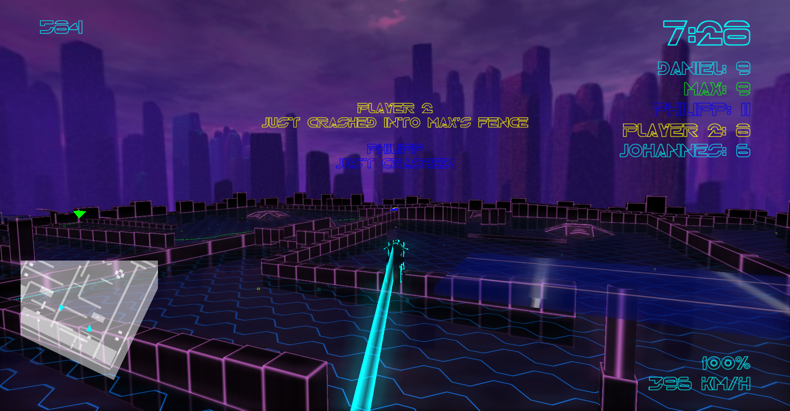
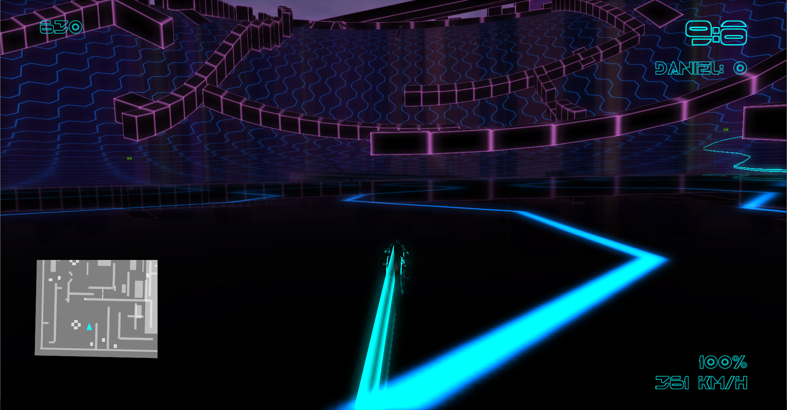

Trön
======

Trön is an action packed 3D-remake of the classic Armagetron
featuring polished graphics, customizable maps, powerups, scriptable AI, multiplayer and many more!

 **Download** the game, see more previews and view the documentation at http://gameprogramming.hpi3d.de/201314/troen/

 The **DataArena** branch integrates with omegalib for distributed rendering in the Data Arena. Find build instructions below.

Trailer
=======

#In Game

##Project Setup
Please file an issue, if you have trouble building the game. 
Download the game data (levels, models,..) from [here](https://www.dropbox.com/sh/ikhbxr1imfdfgvl/AABhB2SlDhMC30u6WPel7t-_a?dl=0) to the data folder, the password is DataArena.

Find the setup instructions below. 
For your convenience, you can download prebuilt binaries of the 3rdParty libraries from [insert link](https://www.dropbox.com/s/o12a9oog7xy85x2/3rdParty.zip?dl=0), which are built for linux-x64 (gentoo).

Contributions are always welcome!

Set up FMOD:
- Download fmod and copy to %ProjectDir%\3rdParty\fmod
- use version 

Set up libzeug
- Download and build [libzeug](https://github.com/cginternals/libzeug) in %ProjectDir%\3rdParty\
- You can use the newest version from the master

Set up RakNet
- Download and build [Raknet](https://github.com/OculusVR/RakNet) in %ProjectDir%\3rdParty\
- You can use the newest version from the master

Edit the CMakeLists.txt to point OMEGA_BINARY_DIR, OmegaLib_SOURCE_DIR and Omegalib_DIR to your omegalib directories.

Then cmake configure, generate and build.

Start Troen from the build directory with:
./startTroen.sh   --> Edit this script to make sure all library paths are pointing to the correct directories